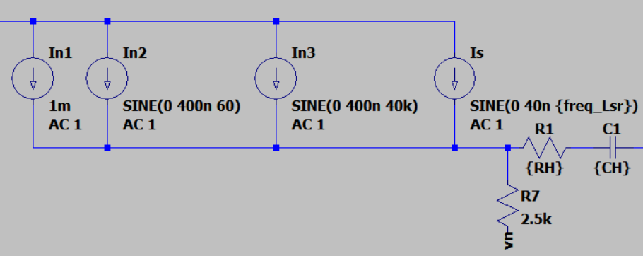

# Receiver Board layout

The receiver layout can essentially be divided into three pices: the power supply, the input signal and associated noise, and the two stage active filter and amplifier.

## Power supply

The power for the board will come from an ESP32, whose output power pin is at 3.3V.  However, when the ESP32 is operating this voltage fluctuates. When our gun is shooting the voltage will fluctuate with the frequency of the shooting frequency. We model the power supply with the fluctuations active on the line to demonstrate the worst case conditions for our circuit.

There are two stages of passive low pass filtering on the power supply. We first filter out the 30mV of noise at our gun's frequency. Then, we split the power supply into two rails for the later amplifying stages, which we call `Vp` and `Vn`. In order to make sure these lines stay steady, we add an additional layer of filtering on their way to ground. At this point, as the power enters into our circuit, we have to remember that our circuit now uses the virtual ground `Vn`.

## Input signals and noise

This section is simple: 4 current sources represent the excitement of a photodiode in response to various sources:
 - In1 is the DC noise from the indoor room lighting.
 - In2 is the 60Hz noise that we find from the power grid. Note this is specific to places that use 60Hz power.
 - In3 is the noise from flourescent lighting, which has an additional frequency component at 40kHz.
 - Is is the desired input signal which comes from one of 9 different laser frequencies (excluding ours as the 10th), which range from 1.471kHz to 4.167kHz.

We will talk about the pictured resistors and capictors in the next section.

## Dual-stage bandpass amplifier

There are three components involved in amplifying the signal: two high pass filters, two amplifiers, and two low pass filters. Note that the two stages of amplification are identical, so we will focus on the first, with the second stages components in parenthesis. 

Before amplifying, we filter out the DC and 60Hz frequencies as much as we can with `R1` _(`C4`)_, `C1` _(`C8`)_, and `R7` _(N/A)_. `R1` and `C1` serve as the actual filter; `R7` is used as a pathway for the low frequency components. Notice as well that we connect `R7` to our virtual ground `Vn`. Our chosen values of `RH = 1k` and `CH = 100nF`give us a corner frequency of 1162Hz.

The amplifiers we use, `U1` _(`U2`)_ are custom op amps with the following values:
 - `Avol=25k`
 - `GBW=1Meg`
 - `Slew=0.6Meg`
 - `Ilimit=6m`
 - `Rail=25m`

We can calculate the gain from each stage by looking at the ratio of the `RL` and `RH` components, where `A = RL / RH`. In our case, because `RL = 200k` and `RH = 1k`, each stage has a gain of 200. The total gain is then `At = 200 * 200 = 40000`.

Finally, during the amplification process is an embedded low pass filter made of `R2` _(`R3`)_ and `C2` _(`C7`)_. This filter works by giving high frequencies a pathway around the amplifier, such that for frequencies above `fc` the gain is 1. Using our chosen values of `RL = 200k` and `CL = 0.05nF`, we can calculate that our high corner frequency is 4660Hz, which sits comfortably close to our laser frequencies without allowing the 40k noise to interfere.

# Results

This is a plot of the FFT of our signal, with each laser frequncy being measured and plotting in a different color.

