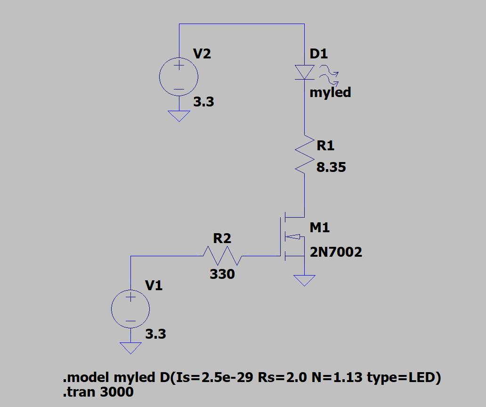

# Transmitter Board Layout

The transmitter layout is a simple circuit powered by a 3.3V supply. There are 8.35 ohms of resistance at the drain of the MOSFET and 330 ohms of resistance at the gate. This circuit ensures that the current through our diode stays at 100 mA and the current through the gate always stays less than 10 mA.
