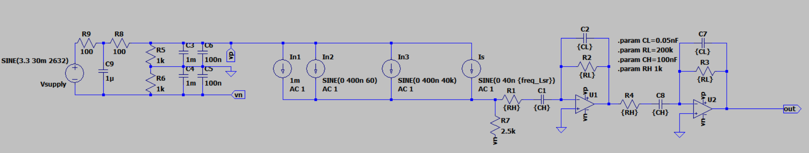
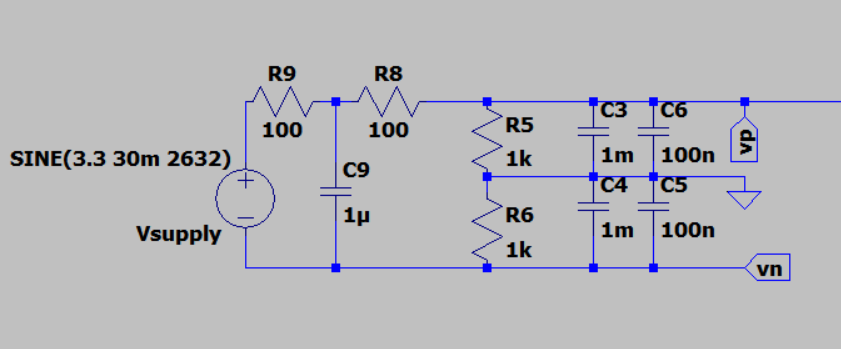
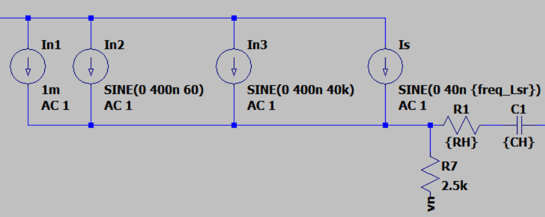
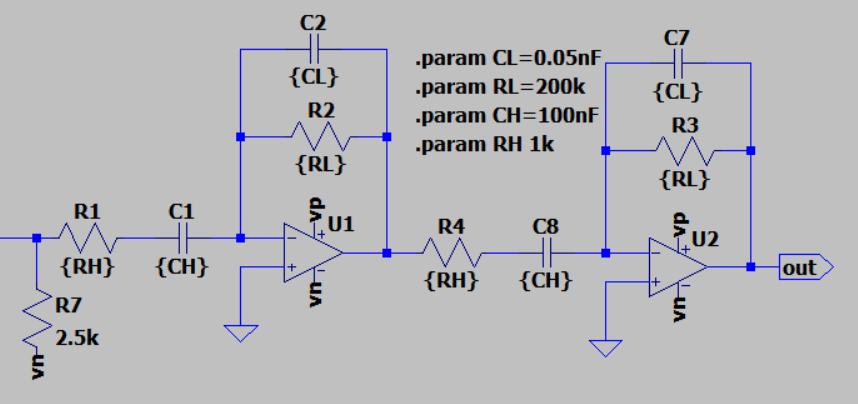
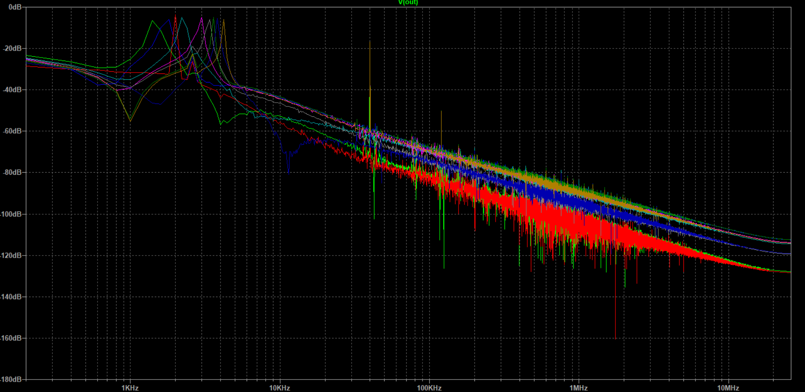
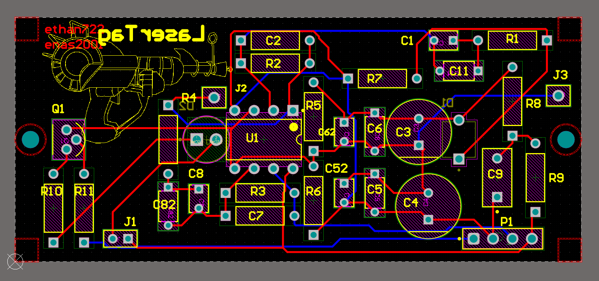
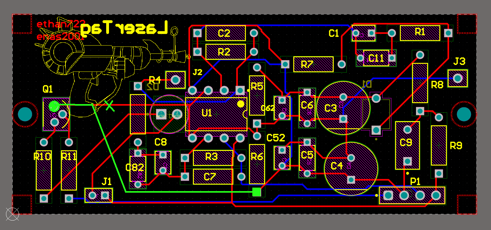

# ECEn 340-board design and Lab Report

Created by E. Sorensen and R. Harper

## In this Repo

- `Altium/` contains the altium design files for the PCB version of the boards (TBD).
- `LTSpice/` contains all the LTspice models for both the receiver board and the transmitter board. As of 11/20/24, all the `readme.md` files detailing their function and design have been moved to this page for lab submission.
- `image/` contains reference images for the documentation.

## Receiver Board layout

The receiver layout can essentially be divided into three pices: the power supply, the input signal and associated noise, and the two stage active filter and amplifier.

### Power supply

The power for the board will come from an ESP32, whose output power pin is at 3.3V.  However, when the ESP32 is operating this voltage fluctuates. When our gun is shooting the voltage will fluctuate with the frequency of the shooting frequency. We model the power supply with the fluctuations active on the line to demonstrate the worst case conditions for our circuit.

There are two stages of passive low pass filtering on the power supply. We first filter out the 30mV of noise at our gun's frequency. Then, we split the power supply into two rails for the later amplifying stages, which we call `Vp` and `Vn`. In order to make sure these lines stay steady, we add an additional layer of filtering on their way to ground. At this point, as the power enters into our circuit, we have to remember that our circuit now uses the virtual ground `Vn`.

### Input signals and noise

This section is simple: 4 current sources represent the excitement of a photodiode in response to various sources:

- In1 is the DC noise from the indoor room lighting.
- In2 is the 60Hz noise that we find from the power grid. Note this is specific to places that use 60Hz power.
- In3 is the noise from flourescent lighting, which has an additional frequency component at 40kHz.
- Is is the desired input signal which comes from one of 9 different laser frequencies (excluding ours as the 10th), which range from 1.471kHz to 4.167kHz.

We will talk about the pictured resistors and capictors in the next section.

### Dual-stage bandpass amplifier

There are three components involved in amplifying the signal: two high pass filters, two amplifiers, and two low pass filters. Note that the two stages of amplification are identical, so we will focus on the first, with the second stages components in parenthesis.

Before amplifying, we filter out the DC and 60Hz frequencies as much as we can with `R1` _(`C4`)_, `C1` _(`C8`)_, and `R7` _(N/A)_. `R1` and `C1` serve as the actual filter; `R7` is used as a pathway for the low frequency components. Notice as well that we connect `R7` to our virtual ground `Vn`. Our chosen values of `RH = 1k` and `CH = 100nF`give us a corner frequency of 1162Hz.

The amplifiers we use, `U1` _(`U2`)_ are custom op amps with the following values:

- `Avol=25k`
- `GBW=1Meg`
- `Slew=0.6Meg`
- `Ilimit=6m`
- `Rail=25m`

We can calculate the gain from each stage by looking at the ratio of the `RL` and `RH` components, where `A = RL / RH`. In our case, because `RL = 200k` and `RH = 1k`, each stage has a gain of 200. The total gain is then `At = 200 * 200 = 40000`.

Finally, during the amplification process is an embedded low pass filter made of `R2` _(`R3`)_ and `C2` _(`C7`)_. This filter works by giving high frequencies a pathway around the amplifier, such that for frequencies above `fc` the gain is 1. Using our chosen values of `RL = 200k` and `CL = 0.05nF`, we can calculate that our high corner frequency is 4660Hz, which sits comfortably close to our laser frequencies without allowing the 40k noise to interfere.

### Results

This is a plot of the FFT of our signal, with each laser frequncy being measured and plotting in a different color.

## Transmitter Board Layout

The transmitter layout is a simple circuit powered by a 3.3V supply. There are 8.35 ohms of resistance at the drain of the MOSFET and 330 ohms of resistance at the gate. This circuit ensures that the current through our diode stays at 100 mA and the current through the gate always stays less than 10 mA.

## Altium Design

Our Altium design takes all the elements described above, and creates one PCB that we can use to drive our transmitter and receiver. the Only difference between the PCB layout is that we now have a 4 pin connector for all the inputs that we will use in our design, along with some test points to measure thigns, and two that both the transmitter and receiver are now in the form factor that is used on the actual laser tag communication link.

## Building the actual board

### Soldering the Board

We received our PCB from JCL, and they looked really good. Here is an image of our PCB after doing the soldering:

IMAGE OF THE SOLDERING

There were a few problems that we had to solve before we were able to test it though. First, we realized that on our LTSpice schematic we had changed R7 to a 2.5k resistor, but our breadboard had a two resistors that added to 2.3k. We tested it virtually and decided that this change was not significant to the board as a whole, so we simply kept the 2.5k resistor design that was on the PCB already.

Another change we had to make though, was our transmitter design. We had designed our PCB for a resistance of 8.35 ohms as shown in our original tranmitter image. However, this was made with a couple resistors together in parallel and series. The problem was though, that now that we had updated the model and found a resistance of 8.9 ohms, the only way to get that specific resistance was to put 4 resitors together in a 2x2 configuration, and we had only given ourselves space for 1 resistor on the board. We were able to fix that with some magical soldering though, and its pictured here:

IMAGE OF MEGA-JANK 1.0

### Testing the Receiver

With all the components soldered together, we were ready to test. Just like with the breadboard test, the receiver worked! Here's a picture of our plotted results on some online grapher, since we don't have the actual image itself.

IMAGE OF THE CSV PLOTTED

 This was very exciting. However, we had one big problem - the transmitter didn't turn on.

### Fixing the Transmitter

#### Connection Issues

We quickly realized that our transmitter wasn't connected to the right ground. Our Altium design connected the "ground" on the transmitter to the "gorund" on the receiver. We had forgotten to account for the fact that our receiver was using a virtual ground, which meant the voltage difference between the gate (and drain) and the source was only half of what we expected. To fix this, we would actally have to cut the trace and create our own. I created this image to show what we had to do:

This was luckily not very hard to do. As pictured with the additional green lines, we cut the trace on the X. We then added a wire that more or less followed the line in the image to connect the source of the transistor to the R6 pin which connected to our negative 3.3 line. When we tested the transmitter after that, it worked! but it gave us a current of 86mA, another problem to solve.

#### Resistance Issues

To fix the new issue, we first tried to see if we could simply replace one of the four resistors with a wire such that the resistance dropped to the right number. our current setup was a 2x2: 20+20 || 1+10. We knew that the 20s wouldn't really be of help to remove here, so we tried covering the 1ohm and the 10ohm. changing the 1ohm brought us up only about 2mA, but when we tried the covering the 10ohm, we saw the current jump to 130mA. Becuase the new resistance without the 10ohm was just under 1 (20+20 || 1) we realized that our resistance needed to be somewhere between 1 and 8. The simplest way to know? Well if we learned anything from LTSpice it was that .step functions work better than math sometimes. So, we took out all four resistors and soldering in two female headers. We then twisted together 1 ohm resistors and increased the resistance by 1 ohm until it gave us the right number (which turned out to be 6ohm). Finally, we soldered the chain of resistors together, took out the headers, and soldered them to the board. Here a picture of our final "resistor rainbow":

IMAGE OF MEGA-JANK 2.0

## Conclusion
